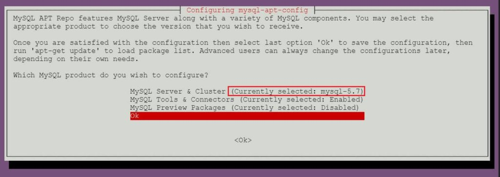
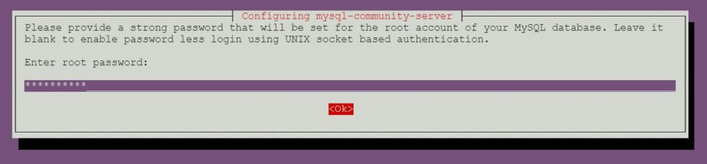
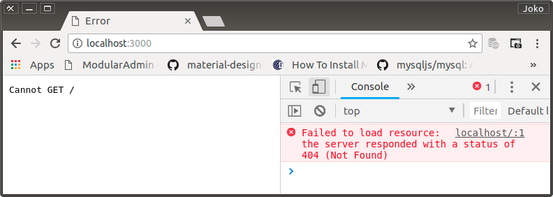

# Build an Enviroment for App

```bash
$ lsb_release -a
No LSB modules are available.
Distributor ID:	Ubuntu
Description:	Ubuntu 14.04.5 LTS
Release:	14.04
Codename:	trusty

$ npm -v
6.0.1

$ node -v
v8.10.0

$ git --version
git version 2.18.0

$ ng -v
Angular CLI: 1.7.3
Node: 8.10.0
OS: linux x64
Angular: 

$ google-chrome --version
Google Chrome 67.0.3396.99
```

## MySQL Installation

Kesulitan mendapatkan informasi yang to the point untuk instalasi di Ubuntu 14.04, akhirnya saya mendapatkan solusi di [sini](https://www.itzgeek.com/how-tos/linux/ubuntu-how-tos/how-to-install-mysql-5-7-8-0-on-ubuntu-16-04-14-04-debian-9-8.html)

0. Add Repository.

    Langsung ke official site MySQL dan membuat repository.

    ```bash
    $ wget https://dev.mysql.com/get/mysql-apt-config_0.8.9-1_all.deb
    $ sudo dpkg -i mysql-apt-config_0.8.9-1_all.deb
    ```

<p align="center">
	
    <br />
    Figure: 001-a-add-repo.jpg
</p>


1. Instalasi

    Cara instalasi sudah sangat berbeda dari versi-versi sebelumnya. Tersedia option dan tidak banyak pernik.

    Saya memilih install MySQL Community Server

    ```bash
    $ sudo apt-get update
    $ sudo apt-get -y install mysql-community-server
    ```

    acc/pssw: root/emd230661

<p align="center">
	
    <br />
    Figure: 001-b-mysql-installation.jpg
</p>

<p align="center">
	
    <br />
    Figure: 001-c-mysql-installation.jpg
</p>

2. Selesai.

## Start MySQL server

After the installation of MySQL, you can start MySQL server using the following command.

```bash
$ ### Ubuntu 16.04 / Debian 9/8 ###
$ sudo systemctl start mysql
$ ### Ubuntu 14.04 ###
$ sudo service mysql start
```

Enable MySQL server at system startup.

```bash
$ ### Ubuntu 16.04 / Debian 9/8 ###
$ sudo systemctl enable mysql
$ ### Ubuntu 14.04 ###
$ sudo update-rc.d mysql defaults
```

Verify that MySQL server service is started using the following command.

```bash
$ ### Ubuntu 16.04 / Debian 9/8 ###
$ sudo systemctl status mysql
$ ### Ubuntu 14.04 ###
$ sudo service mysql status
```

## Work with MySQL Server

```bash
mysql -u root -p

Enter password: 
Welcome to the MySQL monitor.  Commands end with ; or \g.
Your MySQL connection id is 4
Server version: 5.7.21 MySQL Community Server (GPL)

Copyright (c) 2000, 2018, Oracle and/or its affiliates. All rights reserved.

Oracle is a registered trademark of Oracle Corporation and/or its affiliates. Other names may be trademarks of their respective owners.

Type 'help;' or '\h' for help. Type '\c' to clear the current input statement.

mysql>
```

## Change Database Directory

Saya sudah 2 tahun lebih tidak pernah kontak langsung dengan relational database engine seperti MySQL karena sedang asyik dengan graph database engine Neo4J, atau document database MongoDB. Oleh karena itu saya harus mencari lagi sumber belajar yang paling jelas walau akhirnya saya hanya menggunakan isi dari Q&A yang terkait dengan Ubuntu 16.04. Yaitu di [sini](https://dba.stackexchange.com/questions/148517/moving-the-mysql-data-directory-ubuntu-16-04).

Banyak kesalahan yang terjadi saat mengikuti petunjuk tersebut. Walau saya telah dengan seksama mempraktikkannya, tetap saja tidak berhasil. Kemudian saya melakukan trial and error sampai berkali-kali. Upaya mencari informasi dan solusi atas masalah-masalah yang saya hadapi. MySQL official site pun tidak dapat menjawab soalan saya.

Akhirnya, 'voila!' usaha saya tidak sia-sia. Saya tetap berpedoman pada urutan langkah di situs tersebut, tetapi saya menggabungkan beberapa pengalaman selama trial and error sebagai koreksi atas guide tersebut. Berikut adalah langkah-langkah dari guide di atas dan catatan koreksi pembenaran yang telah saya lakukan. 

0. Verify the existing MySQL installation:

    ```bash
    $ mysql -u root -p
    ```

1. From the MySQL prompt, do:

    ```bash
    > select @@datadir;
    ```

    You should see the current data directory:

    ```bash
    /var/lib/mysql/
    ```

2. Exit the MySQL mode:

    ```bash
    > exit
    ```

3. Stop MySQL:

    ```bash
    $ sudo systemctl stop mysql

    # Saya ganti (karena di atas untuk 16.04, saya berada di 14.04) dengan ...

    $ sudo service mysql stop
    ```

4. Verify that MySQL is stopped:

    ```bash
    $ sudo systemctl status mysql

    # Saya ganti dengan command yang sesuai dengan 14.04

    $ sudo service mysql status
    ```

5. Copy the data to the new location:

    ```bash
    $ sudo rsync -av /var/lib/mysql /data/newlocation 
    ```
    (or whatever volume you've created to store the data).

    Di sinilah masalah terbesar saya. Masalah yang solusinya sepele tetapi membutuhkan waktu berjam-jam. Dan saya temukan secara kebetulan.

    Karena sudah capai, saya memilih menggunakan `cp` dari pada `rsync`

    ```bash
    $ sudo cp -R /var/lib/mysql db/emu0

    # Kemudian dirubah permission/previledge-nya menjadi milik mysql

    $ sudo chown -R mysql.mysql db/emu0
    ```
    > Note: 
    > - Directory Aktif: /home/wandyatmono/projects/widuran/rest/
    > - Semua langkah saat menggunakan `async` sebenarnya nggak dijumpai error, tetapi MySQL menjadi tidak jalan. `... * MySQL Community Server 5.7.22 did not start. Please check logs for more details.` Dan saya tidak mengetahui kalau penyebabnya command ini. Jadi, penggunaan `cp` sebagai solusi adalah kehendak yang menciptakan saya.

6. Create a backup of the existing data volume

    ```bash
    $ sudo mv /var/lib/mysql /var/lib/mysql.bak
    ```

7. Tell MySQL about the new location. Edit the file:

    ```bash
    $ sudo nano /etc/mysql/mysql.conf.d/mysqld.cnf
    ```

    and change the `datadir` directive, to reflect the new location:

    ```typescript
    datadir         = /home/wandyatmono/projects/widuran/rest/db/emu0
    ```

8. Tell `AppArmor` about it: edit the file /etc/apparmor.d/tunables/alias and add:

    ```typescript
    alias /var/lib/mysql/ -> /home/wandyatmono/projects/phonelog/adm/db/emu0/,
    ```

    to the bottom of that file (the comma at the end of the line is NOT a typo).

    Then do:

    ```bash
    # sudo systemctl restart apparmor

    sudo service apparmor restart
    ```

9. Create the minimal directory structure, to pass the mysql-systemd-start checks:

    ```bash
    $ sudo mkdir /var/lib/mysql/mysql -p
    ```

10. Start MySQL

    ```bash
    # sudo systemctl start mysql
    $ sudo service mysql start
    ```

11. Check status:

    ```bash
    # sudo systemctl status mysql
    $ sudo service mysql status
    ```

12. Verify that the new data directory is active:

    ```bash
    $ mysql -u root -p
    ```

    At the MySQL prompt, enter:

    ```bash
    SELECT @@datadir;
    ```

13. Remove backup, once everything is verified to work:

    ```bash
    $ sudo rm -Rf /var/lib/mysql.bak
    ```

14. Restart MySQL

    ```bash
    # sudo systemctl restart mysql
    sudo service mysql restart
    ```

15. Check status:

    ```bash
    # sudo systemctl status mysql
    sudo service mysql status
    ```

> Saya tidak konsisten setiap langkah di atas. Yang tidak saya anggap penting tidak saya lakukan atau saya lakukan dengan cara yang berbeda.

## MySql Module for NodeJS Installation

0. Initialisasi aplikasi alias membuat package.json

    ```bash
    $ npm init
    This utility will walk you through creating a package.json file.
    It only covers the most common items, and tries to guess sensible defaults.

    See `npm help json` for definitive documentation on these fields
    and exactly what they do.

    Use `npm install <pkg>` afterwards to install a package and
    save it as a dependency in the package.json file.

    Press ^C at any time to quit.
    package name: (adm) widuranrest
    version: (1.0.0) 0.0.1
    description: WIDURAN - a REST for PMIS
    entry point: (index.js) 
    test command: 
    git repository: 
    keywords: 
    author: Biang Digital Task Force
    license: (ISC) 
    About to write to /home/wandyatmono/projects/widuran/rest/package.json:

    {
        "name": "widuranrest",
        "version": "0.0.1",
        "description": "WIDURAN - a REST for PMIS",
        "main": "index.js",
        "directories": {
            "doc": "docs"
        },
        "scripts": {
            "test": "echo \"Error: no test specified\" && exit 1"
        },
        "author": "Biang Digital Task Force",
        "license": "ISC"
    }
    ```

1. App Dependencies (`mysql` dan `express`)

    ```bash
    $ npm install --save mysql express
    ```

    Mendapatkan versi-versi berikut ini (recorded to package.json):

    ```json
    {
        ...,

        "dependencies": {
            "express": "^4.16.3",
            "mysql": "^2.15.0"
        }
    }
    ```

2. Selesai.

## Manual Test

Dalam rangka menguji bahwa environment sudah `kondusif`, maka `index.js` yang telah 'disebut' oleh `package.json` dibuat.

Untuk sementara hanya satu tugas. Tanpa `route` sama sekali.

    ```javascript
    const express = require('express');
    const mysql = require('mysql');

    const app = express();

    app.listen('3000', () => {
        console.log('Server start on port 3000');
    });
    ```

Karena kebetulan `nodemon` sudah terpasang secara global di system-envo, index.js dieksekusi.

```bash
$ nodemon index.js
[nodemon] 1.17.3
[nodemon] to restart at any time, enter `rs`
[nodemon] watching: *.*
[nodemon] starting `node index.js`
Server start on port 3000
```

Jalan!

<p align="center">
	
    <br />
    Figure: 001-d-mysql-installation.png
</p>

## Git Initialization

0. Init

    ```bash
    $ git init
    Initialized empty Git repository in /home/wandyatmono/projects/widuran/rest/.git/
    ```

1. Membuat `.gitignore`

    Kemudian membuat (secara manual) `.gitignore`. Yaitu dengan cara menyalin dari proyek lain yang menggunakan angular. Banyak file-file yang nggak boleh masuk ke `github` karena akan menjadi obstacle saat di download oleh orang lain dan diletakkan di system mereka yang tidak menggunakan system-envo seperti yang saya gunakan.

    Saya hanya menambah direktori database yang permission-nya untuk `mysql-group`. Yaitu `/db`.

2. Remote Repository belum saya buat.