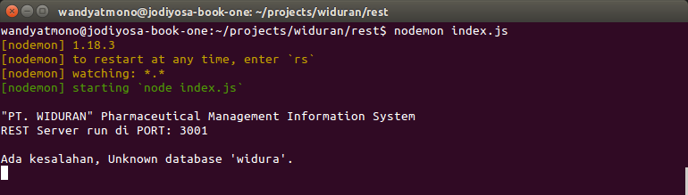
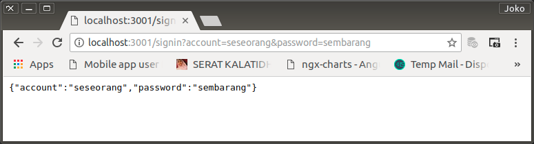
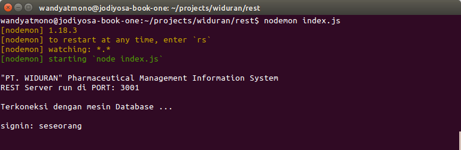
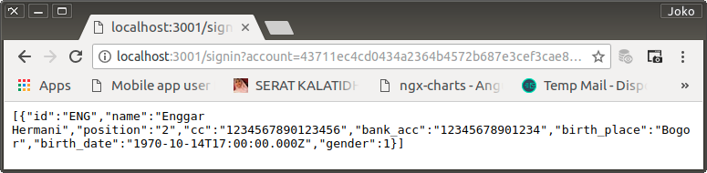
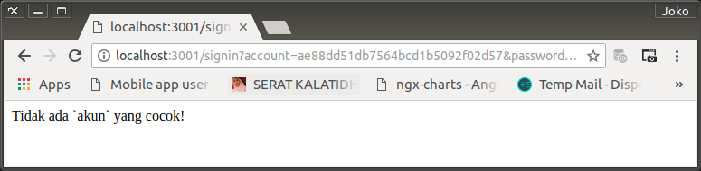
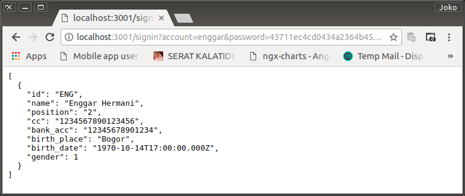
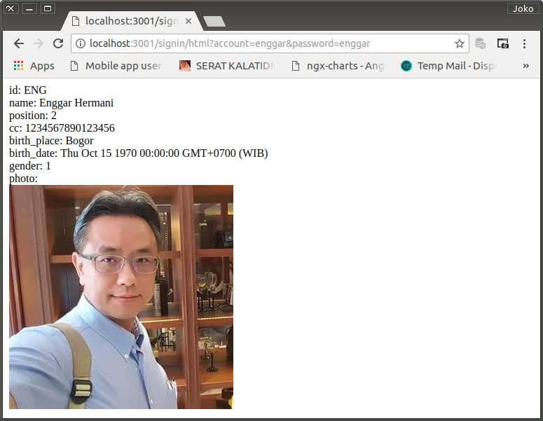

# Build Widuran DB

## Create schemma

```sql
CREATE SCHEMA `widuran`
DEFAULT CHARACTER SET utf8 COLLATE utf8_unicode_ci;
```

## First Refference Tables

Untuk memulai pengembangan aplikasi, salah satu _prequisite_ yang harus dipenuhi adalah adanya data yang dapat dipergunakan sebagai pedoman untuk menghantarkan `user` ke `application navigator`. _Feature_ yang dapat menghantarkannya ke berbagai routines yang disediakan khusus untuk user yang bersangkutan.

Berikut adalah data penting untuk keperluan tersebut.

0. Create applications header

    ```sql
    CREATE TABLE `widuran`.`app_header` (
        `id` VARCHAR(2) NOT NULL,
        `header_origin` VARCHAR(45) NULL,
        `header` VARCHAR(45) NULL,
        PRIMARY KEY (`id`)
    );
    ```

    Data: `docs/dumps/app_header_20180731.sql`

2. Create applications body

    ```sql
    CREATE TABLE `widuran`.`app_body` (
        `id` VARCHAR(2) NOT NULL,
        `body_origin` VARCHAR(45) NULL,
        `body` VARCHAR(45) NULL,
        PRIMARY KEY (`id`)
    );
    ```

    Data: app_header_1180731.sql

3.  Create roles table

    ```sql
    CREATE TABLE `widuran`.`roles` (
        `id` VARCHAR(2) NOT NULL,
        `roles_origin` VARCHAR(45) NULL,
        `roles` VARCHAR(45) NULL,
        PRIMARY KEY (`id`),
        UNIQUE INDEX `id_UNIQUE` (`id` ASC)
    );
    ```

    Data: roles_3180731.sql

4. Create users table

    ```sql
    CREATE TABLE `widuran`.`users` (
        `id` VARCHAR(3) NOT NULL,
        `position` VARCHAR(2) NULL,
        `cc` VARCHAR(16) NULL,
        `bank_acc` VARCHAR(45) NULL,
        `birth_place` VARCHAR(45) NULL,
        `birth_date` DATE NULL,
        `gender` TINYINT(1) NULL,
        `photo` LONGBLOB NULL,
        `signature` BLOB NULL
        PRIMARY KEY (`id`)
    );
    ```

    Data: users_4180731.sql

    Untuk mengisi `account` dan `password` digunakan [konverter SHA256 ini](http://emn178.github.io/online-tools/sha256.html).

    Untuk `photo` dan `signature` masih dibiarkan kosong.

## DB Services

Setelah terbentuk beberapa buah data table di atas, pada REST Server sudah bisa dibuatkan beberapa layanan penting seperti misalnya: `get user previledges` saat `user signin`, `tupple of cookie` untuk `user log status`, dsb.

0. Koneksi DB

    `index.js`

    ```javascript
    const express = require('express');
    const mysql = require('mysql');

    const app = express();

    app.listen('3001', () => {
        console.log('"PT. WIDURAN" Pharmaceutical Management Information System');
        console.log('REST Server run on PORT: 3001');
    });

    var connection = mysql.createConnection({
        host     : 'localhost',
        user     : 'root',
        password : 'emd230661',
        database : 'widuran'
    });

    connection.connect();
    ```

    `index.js` di jalankan dengan bantuan `nodemon` agar setiap kali ada updating terhadap script, index.js langsung dapat di refresh tanpa harus menjalankannya kembali secara manual.

1.  Error Message di console

    Memperbaiki tampilan informasi dan error message di console.

    ```javascript
    const express = require('express');
    const mysql = require('mysql');

    const app = express();

    app.listen('3001', () => {
        console.log('');
        console.log('"PT. WIDURAN" Pharmaceutical Management Information System');
        console.log('REST Server run di PORT: 3001');
    });

    var db = mysql.createConnection({
        host     : 'localhost',
        user     : 'root',
        password : 'emd230661',
        database : 'widura'
    });

    db.connect((err) => {
        console.log('');
        if (err) {
            console.log('Ada kesalahan, ' + err.sqlMessage + '.');
        } else {
            console.log('Terkoneksi dengan mesin Database ...');
        }
    });
    ```

<p align="center">
	
    <br />
    Figure: 002-a-error-message.png
</p>

2. Percobaan request dari browser

    Ke dalam REST Server dibuat sebuah routes, '/signin'

    ```javascript
    app.get('/signin', (req, res) => {
        console.log('');
        console.log('signin: ' + req.query.account);
        res.send(req.query);
    });
    ```

<p align="center">
	
    <br />
    Figure: 002-b-request-browser.png
</p>

<p align="center">
	
    <br />
    Figure: 002-c-request-console.png
</p>

3. Validasi saat user signin

    Dicoba dibuatkan sebuah request untuk nge-match-kan account dan password. Jika matched, hasilnya adalah record dari user yang bersangkutan.

    ```javascript
        app.get('/signin', (req, res) => {
            sql = `SELECT id, name, position, cc, bank_acc, birth_place, birth_date, gender `;
            sql += `FROM widuran.users `;
            sql += `WHERE `;
            sql += `account='` + req.query.account;
            sql += `' AND password='` + req.query.password + `'`;

            db.query(sql, (err, results) => {
                if (err) {
                    throw(err);
                } else {
                    if (results > '') {
                        res.send(results);
                    } else {
                        res.send('Tidak ada `akun` yang cocok!');
                    }
                }
            });
        });
    ```

    Pada `/signin` route di atas, request yang harus dilakukan oleh user adalah 
    
        `domain/signin?account=<account dalam sha256>&password=<password dalam sha246>

    Contoh: `http://localhost:3001/signin?account=43711ec4cd0434a2364b4572b687e3cef3cae88dd51db7564bcd1b5092f02d57&password=43711ec4cd0434a2364b4572b687e3cef3cae88dd51db7564bcd1b5092f02d57`

<p align="center">
	
    <br />
    Figure: 002-d-accpssw-matching-request.png
</p>

    Jika tidak matched!

<p align="center">
	
    <br />
    Figure: 002-e-accpssw-unmatched-request.png
</p>

4.  Memasang `express-prettify`

    Agar data yang diterima browser (selanjutnya akan disebut `client`) mudah untuk dibaca. Data yang berbentuk JSON tersebut harus ditata. Dan untuk kepentingan tersebut digunakan sebuah library bernama [`express-prettify`](https://www.npmjs.com/package/express-prettify).

    ```bash
    $ npm install express-prettify --save
    ```

    Library tersebut cukup di-include ke `index.js`.

    ```javascript
    const express = require('express');
    const mysql = require('mysql');
    const pretty = require('express-prettify');

    const app = express();

    app.use(pretty({ query: 'pretty' }));

    /* ... */
    ```

    Dan kemudian tambahan sebagai argumen disaat client melakukan request. Contoh: `http://localhost:3001/signin?account=43711ec4cd0434a2364b4572b687e3cef3cae88dd51db7564bcd1b5092f02d57&password=43711ec4cd0434a2364b4572b687e3cef3cae88dd51db7564bcd1b5092f02d57&pretty`

<p align="center">
	
    <br />
    Figure: 002-f-json-prettify.png
</p>

5. Memasang `js-sha256`

    Data untuk `account` request biasanya cukup dengan teks yang dimasukkan lewat form atau cara yang lain. Berbeda dengan password yang sudah dikonversi oleh client. Untuk itu sebuah library baru perlu dilibatkan. yaitu [`js-sha256`](https://github.com/emn178/js-sha256). Versi [online](http://emn178.github.io/online-tools/sha256.html)-nya juga sangat membantu untuk uji-coba.

    Instalasi:

    ```bash
    $ npm install js-sha256 --save
    ```

    Penyertaan di `index.js`

    ```javascript
    const sha256 = require('js-sha256').sha256;
    ```

    Kemudian, `account` harus dikonversi saat menyusun sql.

    ```javascript
        sql = `SELECT id, name, position, cc, bank_acc, birth_place, birth_date, gender `;
        sql += `FROM widuran.users `;
        sql += `WHERE `;
        sql += `account='` + sha256(req.query.account);
        sql += `' AND password='` + req.query.password + `'`;
    ```

    Request dapat dilakukan sbb: `http://localhost:3001/signin?account=enggar&password=43711ec4cd0434a2364b4572b687e3cef3cae88dd51db7564bcd1b5092f02d57&pretty`

<p align="center">
	
    <br />
    Figure: 002-g-sha256-conversion.png
</p>

## Perihal photo pada `users`

Pada saat CREATE, `users` table telah dibuat memiliki `photo` field (dan `signature`) yang bertype LONGBLOB karena sejak awal memang diniatkan untuk diisi dengan image berformat BASE64. Berikut, akan di masukkan (secara manual) photo-photo dari para 'dummy-users'. Photo diambil dari facebook photo profile dan diletakkan di direktori `photos`.

0. Konversi ke BASE64

    Untuk melakukan konversi ke BASE64, digunakan online converter site yang cukup bagus. Yaitu: `https://www.base64-image.de/`. Hasilnya langsung dimasukkan ke dalam field yang bersangkutan.

    Sebelum di konversi, masing-masing image di kecilkan dimensinya menjadi 200px width. Proses `shrink` dilakukan dengan bantuan aplikasi imagemagick yang telah terpasang di development-system dan dilakukan dengan command-line.

    Contoh:

    ```bash
    convert yusnita_sri_sundari.jpg -resize 320 yusnita_sri_sundari.jpg
    ```

    Maka yusnita_sri_sundari.jpg yang semula lebar, akan dirubah menjadi selebar 320px dan dengan tinggi sesuai aspect-ratio dari image yang bersangkutan.

    Guide-nya [di sini](https://www.howtogeek.com/109369/how-to-quickly-resize-convert-modify-images-from-the-linux-terminal/)

    Dengan petunjuk [stackoverflow](https://stackoverflow.com/questions/32698451/how-do-i-convert-a-base64-image) ini, dapat pula dilakukan konversi dengan nyaman.

    ```bash
    # For example
    convert rose: rose.png
    # Create base64 file
    openssl enc -base64 -in yusnita_sri_sundari.jpg -out yusnita_sri_sundari.txt
    ```

    Isi file hasil konversi bisa langsung di copy-paste ke tabel seperti saat menggunakan cara 'online'. Hasil dump tabel `users` disimpan di `docs/dumps/users_5180801.sql`.

1. Mengirim data ke client dalam bentuk file HTML

    Alternative lain pengiriman data ke client adalah langsung dengan kode HTML. Bisa dengan 'membaca' file HTML dan kemudian tinggal mengirimkannya ke client, atau bisa secara hardcoded.

    Berikut adalah penambahan route baru `/signin/html` yang akan mengirim HTML-page ke client dengan cara harcoded.

    Dengan mengirim HTML-page, diharapkan `photo` bisa ikut ditampilkan.

    ```javascript
    app.get('/signin/html', (req, res) => {
        sql = `SELECT id, name, position, cc, bank_acc, birth_place, birth_date, gender, photo `;
        sql += `FROM widuran.users `;
        sql += `WHERE `;
        sql += `account='` + sha256(req.query.account);
        sql += `' AND password='` + sha256(req.query.password) + `'`;

        db.query(sql, (err, results) => {
            if (err) {
                throw(err);
            } else {
                if (results > '') {
                    results = results[0];
                    res.writeHead(200, {'content-type': 'text/html'});
                    res.write('<div>id: ' + results.id + '</div>');
                    res.write('<div>name: ' + results.name + '</div>');
                    res.write('<div>position: ' + results.position + '</div>');
                    res.write('<div>cc: ' + results.cc + '</div>');
                    res.write('<div>birth_place: ' + results.birth_place + '</div>');
                    res.write('<div>birth_date: ' + results.birth_date + '</div>');
                    res.write('<div>gender: ' + results.gender + '</div>');
                    res.write('<div>photo: <br /></div>');
                    res.end();
                } else {
                    res.send('Tidak ada `akun` yang cocok!');
                }
            }
        });
    });
    ```

    Catatan: 

    Perhatikan saat penyusunan sql, data `password` dari client juga dikonversi menjadi SHA256, sehingga saat melakukan request, client tidak perlu mengirimkan password dalam bentuk SHA256 seperti sebelumnya.

    Untuk kepentingan pengembangan, semua `password` sengaja dibuat sama dengan account. dan account sendiri adalah kata pertama dari nama dan dalam huruf lowercase semua (enggar, lani, yustina, wongso).

<p align="center">
	
    <br />
    Figure: 002-h-base64-to-image.png
</p>

